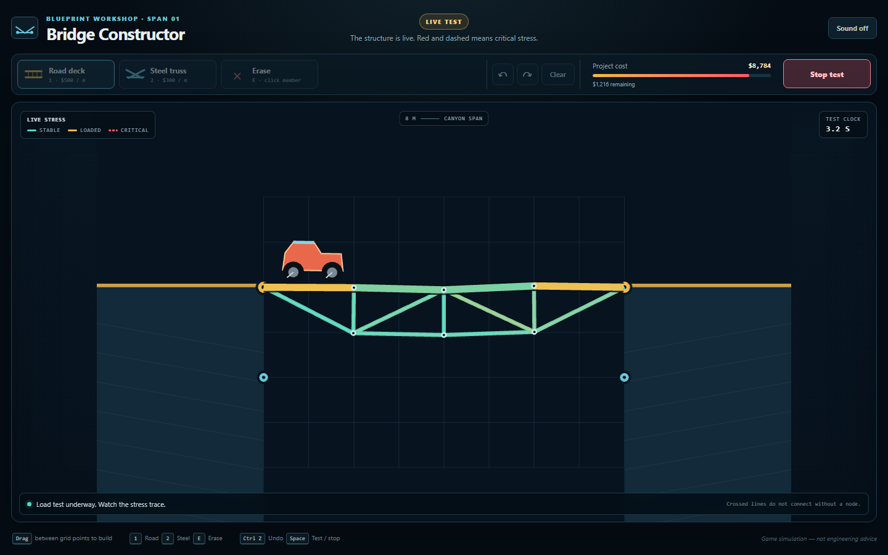

# Bridge Constructor

A desktop browser physics game about designing a steel truss, reading its live stress, and
getting a truck across an eight-meter canyon.

**[Play the latest release](https://isaiahcampusano.github.io/bridgeconstructor/)**



## The challenge

Connect the two gold road anchors with deck segments, then brace the roadway with steel
triangles. Every meter costs money, crossed lines only connect at visible nodes, and the
complete bridge must stay within the $10,000 budget.

When the load test begins, a two-wheel truck drives itself across. Members change from teal
to amber to red as joint reaction forces approach their limit. A critically loaded member
becomes dashed and pulses before its joint physically breaks.

### Controls

| Action | Mouse | Keyboard |
| --- | --- | --- |
| Place a member | Drag between grid points | Select road with `1` or steel with `2` |
| Remove a member | Choose Erase, then click it | `E`, then click it |
| Undo / redo | Toolbar buttons | `Ctrl+Z` / `Ctrl+Y` |
| Run or stop test | Load-test button | `Space` |

The first release is designed for desktop screens of at least 1024×650.

## Run locally

Requires Node.js 24 or a current compatible release.

```bash
npm install
npm run dev
```

The quality gate is:

```bash
npm run check
npm run typecheck
npm test
npm run build
npm run test:e2e
```

Install the Playwright browser once before the final command:

```bash
npx playwright install chromium
```

## Physics model

- [Planck.js](https://piqnt.github.io/planck.js/docs/) supplies deterministic Box2D-style
  rigid-body simulation at a fixed 1/120-second step.
- Dynamic connection nodes carry explicit mass. Steel is represented by damped distance
  joints; deck segments are collidable bodies connected to nodes with revolute joints.
- The truck is a chassis with two suspended wheels. Stored wheel joints drive the motor;
  wheel angular velocity is never forced directly.
- Stress comes from `getReactionForce(1 / dt)`, not visual stretching. Steel distinguishes
  tension from compression; deck utilization combines endpoint reaction force with an
  approximate bending moment.
- A member breaks after 120 ms above 100% utilization, or immediately above 150%.
  Breaking destroys its Planck joint, so the bridge physically loses support.

The documented reference solution uses four two-meter road segments and a compact truss at
`y = -1`. It costs $8,784, or 87.8% of the budget, and is covered by a deterministic
truck-crossing test.

This is an intentionally readable game simulation, not structural-engineering software or
engineering advice.

## Project structure

- `src/model.ts` — immutable bridge editing, snapping, budget, and connectivity rules.
- `src/simulator.ts` — disposable physics world, truck, reaction-force stress, and failure.
- `src/game.ts` — game state, PixiJS rendering, interactions, audio, and result flow.
- `src/level.ts` — data-driven level, materials, strength limits, and reference bridge.
- `e2e/` — desktop browser acceptance tests.

GitHub Actions runs formatting, linting, type checks, deterministic tests, browser tests, and
the production build before deploying `main` to GitHub Pages.

## License

[MIT](LICENSE)
